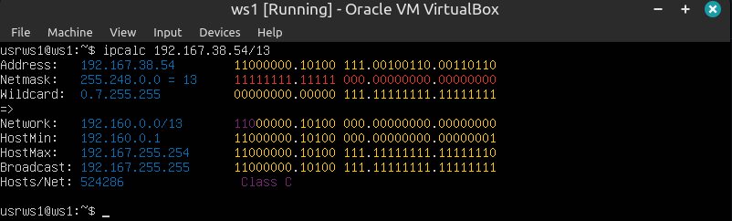
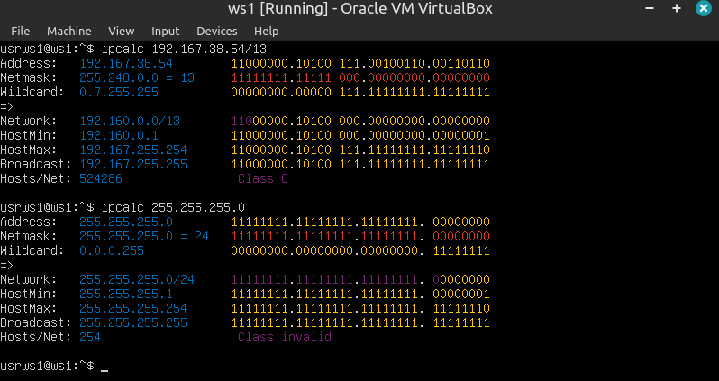
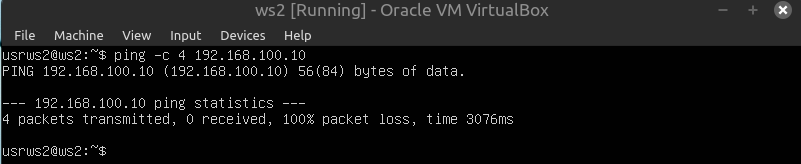
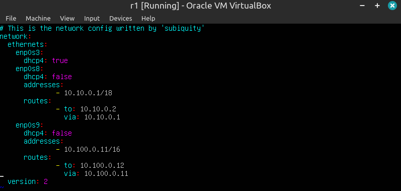
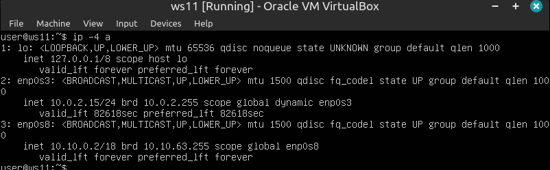
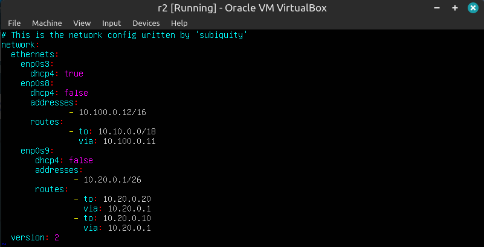

## Contents

1. [Инструмент ipcalc](#part-1-инструмент-ipcalc)
2. [Статическая маршрутизация между двумя машинами](#part-2-статическая-маршрутизация-между-двумя-машинами)
3. [Утилита iperf3](#part-3-утилита-iperf3)
4. [Сетевой экран](#part-4-сетевой-экран)
5. [Статическая маршрутизация сети](#part-5-статическая-маршрутизация-сети)
6. [Динамическая настройка IP с помощью DHCP](#part-6-динамическая-настройка-ip-с-помощью-dhcp)
7. [NAT](#part-7-nat)
8. [Допополнительно. Знакомство с SSH Tunnels](#part-8-дополнительно-знакомство-с-ssh-tunnels)


## Part 1. Инструмент ipcalc

#### 1.1. Сети и маски

IPCALC вычисляет широковещательный адрес, диапазон хостов, шаблон сетевой маски по полученному IP и сетевой маске.

Для установки нужно выполнить команду ``sudo apt install ipcalc``

* Адрес сети 192.167.38.54/13 - ``192.160.0.0/13``



* Перевод маски:
  
 1) 255.255.255.0:

    -- префиксная ``/24``;

    -- двоичная ``11111111.11111111.11111111.00000000``;



 2) /15:

    -- обычная ``255.254.0.0``;

    -- двоичная ``11111111.11111110.00000000.00000000``;


 2) 11111111.11111111.11111111.11110000:

    -- обычная ``255.255.255.240``;

    -- префиксная ``/28``;


* Минимальный и максимальный хост в сети 12.167.38.4 при масках:

 1) /8:

    -- минимальная ``12.0.0.1``;

    -- максимальная ``12.255.255.254``;


 2) 11111111.11111111.00000000.00000000:

    -- минимальная ``12.167.0.1``;

    -- максимальная ``12.167.255.254``;


3) 255.255.254.0:

    -- минимальная ``12.167.38.1``;

    -- максимальная ``12.167.39.254``;


 4) /4:

    -- минимальная ``0.0.0.1``;

    -- максимальная ``15.255.255.254``;


#### 1.2. localhost

localhost (так называемый, «местный» от англ. local, или «локальный хост», по смыслу — этот компьютер) — в компьютерных сетях, стандартное, официально зарезервированное доменное имя для частных IP-адресов (в диапазоне 127.0.0.1 — 127.255.255.254).

Можно обратиться в тех случаях, когда IP:

* 127.0.0.2;
* 127.1.0.1;


#### 1.3. Диапазоны и сегменты сетей

1) IP можно использовать в качестве:

 * публичного:
   * 134.43.0.2;
   * 172.0.2.1;
   * 192.172.0.1;
   * 172.68.0.2;
   * 192.169.168.1;
 * частного:
   * 10.0.0.45;
   * 192.168.4.2;
   * 172.20.250.4;
   * 10.10.10.10;
   * 172.16.255.255.


2) IP адресов шлюза возможны у сети 10.10.0.0/18: 
 * 10.0.0.1 - нет;
 * 10.10.0.2 - да;
 * 10.10.10.10 - да;
 * 10.10.100.1 - нет;
 * 10.10.1.255 - да.


## Part 2. Статическая маршрутизация между двумя машинами

**Поднять две виртуальные машины (далее -- ws1 и ws2)**


**С помощью команды ``ip a`` посмотреть существующие сетевые интерфейсы**


**Описать сетевой интерфейс, соответствующий внутренней сети, на обеих машинах и задать следующие адреса и маски: ws1 - 192.168.100.10, маска /16, ws2 - 172.24.116.8, маска /12**


Выполнить команду ``netplan apply`` для перезапуска сервиса сети


#### 2.1. Добавление статического маршрута вручную

Сначала в VirtualBox настраиваем внутреннюю сеть для обоих серверов.

**Добавить статический маршрут от одной машины до другой и обратно при помощи команды вида ``ip r add``**

На сервере ws1 вводим команду ``ip r add 172.24.116.8 dev enp0s3``.

На сервере ws2 вводим команду ``ip r add 192.168.100.10 dev enp0s3``.

Пингуем машины:
 * ws1 ``ping 172.24.116.8``
 * ws2 ``ping 192.168.100.10``


#### 2.2. Добавление статического маршрута с сохранением

**Добавить статический маршрут от одной машины до другой с помощью файла etc/netplan/00-installer-config.yaml**


``netplan apply`` для перезапуска сервиса сети

Пингуем машины


## Part 3. Утилита iperf3

#### 3.1. Скорость соединения

**Перевести и записать в отчёт: 8 Mbps в MB/s, 100 MB/s в Kbps, 1 Gbps в Mbps**

* 8Mbps = 1MB/s;
* 100MB/s = 819200 Kbps;
* 1Gbps = 1024 Mbps.

#### 3.2. Утилита **iperf3**

**Измерить скорость соединения между ws1 и ws2**

Устанавливаем утилиту **iperf3** с помощью команды ``sudo apt -y install iperf3``

На сервере **ws1** запускаем команду ``iperf3 -s``

С сервера **ws2** присоединяемся по ip к **ws1**командой ``iperf3 -c 192.168.100.10``


## Part 4. Сетевой экран

#### 4.1. Утилита **iptables**

##### Создать файл */etc/firewall.sh*, имитирующий фаерволл, на ws1 и ws2:
```shell
#!/bin/sh

# Удаление всех правил в таблице "filter" (по-умолчанию).
iptables –F
iptables -X
```
##### Нужно добавить в файл подряд следующие правила:
##### 1) на ws1 применить стратегию когда в начале пишется запрещающее правило, а в конце пишется разрешающее правило (это касается пунктов 4 и 5)
##### 2) на ws2 применить стратегию когда в начале пишется разрешающее правило, а в конце пишется запрещающее правило (это касается пунктов 4 и 5)
##### 3) открыть на машинах доступ для порта 22 (ssh) и порта 80 (http)
##### 4) запретить *echo reply* (машина не должна "пинговаться”, т.е. должна быть блокировка на OUTPUT)
##### 5) разрешить *echo reply* (машина должна "пинговаться")

Создаем файлы ``/etc/firewall.sh``

 

Теперь пробуем снова пинговать друг друга

 

Проверка команд в списке iptables делается последовательно. Если условие удовлетворяет, то происходит действие.

На ws1 первое условие - это запрет на пингование. Когда запрос поступает, система выполняет условие и ответ не уходит. На ws2 пингование разрешено и он отправляет ответ, что видно на скриншотах.

#### 4.2. Утилита **nmap**

**Командой ping найти машину, которая не "пингуется", после чего утилитой nmap показать, что хост машины запущен**

На скриншоте видно, что **ws1** не пингуется


Устанавливаем **nmap** командой ``sudo apt-get install nmap``

Пингуем с помощью **nmap** и видим ``host is up``, что означает, что **ws1** запущен.


## Part 5. Статическая маршрутизация сети

**Поднять пять виртуальных машин (3 рабочие станции (ws11, ws21, ws22) и 2 роутера (r1, r2))**

#### 5.1. Настройка адресов машин

**Настроить конфигурации машин в etc/netplan/00-installer-config.yaml согласно сети на рисунке.**





Проверяем, что все игнтерфейсы отображаются командой ``ip -4 a``





Пингуем с **ws21** **ws22**


Пингуем с **ws11** **r1**


#### 5.2. Включение переадресации IP-адресов

Для включения переадресации IP, выполните команду на роутерах ``sysctl -w net.ipv4.ip_forward=1``


Открываем на роутерах файл ``/etc/sysctl.conf`` и раскомментируем строку ``net.ipv4.ip_forward = 1``
При использовании этого подхода, IP-переадресация включена на постоянной основе.


#### 5.3. Установка маршрута по-умолчанию

**Настроить маршрут по-умолчанию (шлюз) для рабочих станций. Для этого добавить ``default`` перед IP роутера в файле конфигураций**

Изменяем файлы конфигураций на всех рабочих станциях


Проверяем командой ``ip r``, что настройки применились


**Пропинговать с ws11 роутер r2 и показать на r2, что пинг доходит**

На **r2** запускаем команду ``tcpdump -tn -i enp0s8``, а с **ws11** отправляем на **r2** пакеты ``ping -c 6 10.100.0.12``. Наблюдаем, что **r2** принимает пакеты


#### 5.4. Добавление статических маршрутов

**Добавить в роутеры r1 и r2 статические маршруты в файле конфигураций. Пример для r1 маршрута в сетку 10.20.0.0/26:**
```shell
# Добавить в конец описания сетевого интерфейса eth1:
- to: 10.20.0.0
  via: 10.100.0.12
```




**Вызвать `ip r` и показать таблицы с маршрутами на обоих роутерах. Пример таблицы на r1:**
```
10.100.0.0/16 dev eth1 proto kernel scope link src 10.100.0.11
10.20.0.0/26 via 10.100.0.12 dev eth1
10.10.0.0/18 dev eth0 proto kernel scope link src 10.10.0.1
```


**Запустить команды на ws11:**
`ip r list 10.10.0.0/[маска сети]` и `ip r list 0.0.0.0/0`


Маршрут по умолчанию используется, если ни один из маршрутов в таблице маршрутизации не совпадает с IP-адресом места назначения пакета. Eсли нет более точных совпадений, то шлюзом будет маршрут по умолчанию. Для адреса 10.10.0.0/18 был выбран маршрут, отличный от 0.0.0.0/0, поскольку он является адресом сети и доступен без шлюза.


#### 5.5. Построение списка маршрутизаторов

**Запустить на r1 команду дампа:** ``tcpdump -tnv -i eth0``

**При помощи утилиты traceroute построить список маршрутизаторов на пути от ws11 до ws21**


Передача информации осуществляется в виде пакетов.  Данные разбиваются  программным обеспечением и отправляются через сеть к целевому узлу, где уже обратно собираются.

Пакеты проходят на  пути определенное количество узлов, пока не достигнут цели. Количество узлов, которые может пройти пакет перед тем, как будет уничтожен - это его время жизни (TTL). 

Для определения промежуточных маршрутизаторов traceroute отправляет целевому узлу серию ICMP-пакетов, увеличивая значение TTL на 1. Этомаксимальное количество маршрутизаторов, которое может быть пройдено пакетом. Первая серия пакетов отправляется с TTL, равным 1, и поэтому первый же маршрутизатор возвращает обратно ICMP-сообщение «time exceeded in transit», указывающее на невозможность доставки данных. Traceroute фиксирует адрес маршрутизатора, а также время между отправкой пакета и получением ответа. Затем traceroute повторяет отправку серии пакетов, но уже с TTL, равным 2, что заставляет первый маршрутизатор уменьшить TTL пакетов на единицу и направить их ко второму маршрутизатору. Второй маршрутизатор, получив пакеты с TTL=1, так же возвращает «time exceeded in transit».

Процесс повторяется до тех пор, пока пакет не достигнет целевого узла, тем самым увеличивая значение TTL. При получении ответа от этого узла процесс трассировки считается завершённым.

#### 5.6. Использование протокола **ICMP** при маршрутизации

**Запустить на r1 перехват сетевого трафика, проходящего через eth0 с помощью команды:** ``tcpdump -n -i eth0 icmp``

**Пропинговать с ws11 несуществующий IP (например, 10.30.0.111) с помощью команды:** ``ping -c 1 10.30.0.111``


## Part 6. Динамическая настройка IP с помощью DHCP

Для r2 настроить в файле ``/etc/dhcp/dhcpd.conf`` конфигурацию службы DHCP:

* указать адрес маршрутизатора по-умолчанию, DNS-сервер и адрес внутренней сети. Пример файла для r2:
```shell
subnet 10.100.0.0 netmask 255.255.0.0 {}

subnet 10.20.0.0 netmask 255.255.255.192
{
    range 10.20.0.2 10.20.0.50;
    option routers 10.20.0.1;
    option domain-name-servers 10.20.0.1;
}
```

Устанавливаем ``isc-dhcp-server``


* в файле ``resolv.conf`` прописать ``nameserver 8.8.8.8``


* Перезагрузить службу DHCP командой ``systemctl restart isc-dhcp-server``. Машину ws21 перезагрузить при помощи reboot и через ``ip a`` показать, что она получила адрес. Также пропинговать ws22 с ws21.


* Указать MAC адрес у ws11, для этого в ``etc/netplan/00-installer-config.yaml`` надо добавить строки: ``macaddress: 10:10:10:10:10:BA``

``dhcp4: true``

Прописываем MAC addres


* Для r1 настроить аналогично r2, но сделать выдачу адресов с жесткой привязкой к MAC-адресу (ws11). Провести аналогичные тесты


* Запросить с ws21 обновление ip адреса

Проверяем командой ``ip a`` ip адрес машины **ws21**


Удаляем ip командой ``sudo dhclient -r enp0s8``


запрашиваем ip командой ``sudo dhclient`` и видим новый ip


Пингуемся с **ws21** до **ws22** и обратно, проверяя работоспособность нового ip


## Part 7. NAT

* **В файле ``/etc/apache2/ports.conf`` на ws22 и r1 изменить строку Listen 80 на Listen 0.0.0.0:80, то есть сделать сервер Apache2 общедоступным**

Сначала установим пакет apache2 командой ``sudo apt-get install apache2``


* **Запустить веб-сервер Apache командой ``service apache2 start`` на ws22 и r1**


* **Добавить в фаервол, созданный по аналогии с фаерволом из Части 4, на r2 следующие правила:**

 * 1) Удаление правил в таблице filter ``- iptables -F``

 * 2) Удаление правил в таблице "NAT" ``- iptables -F -t nat``

 * 3) Отбрасывать все маршрутизируемые пакеты ``- iptables --policy FORWARD DROP``

Запускать файл также, как в Части 4

Проверить соединение между ws22 и r1 командой ping

*При запуске файла с этими правилами, ws22 не должна "пинговаться" с r1*


Добавить в файл ещё одно правило:

 * 4) Разрешить маршрутизацию всех пакетов протокола ICMP

Запускать файл также, как в Части 4

Проверить соединение между ws22 и r1 командой ping

*При запуске файла с этими правилами, ws22 должна "пинговаться" с r1*


* **Включить SNAT, а именно маскирование всех локальных ip из локальной сети, находящейся за r2 (по обозначениям из Части 5 - сеть 10.20.0.0)**

* **Включить DNAT на 8080 порт машины r2 и добавить к веб-серверу Apache, запущенному на ws22, доступ извне сети**


* **Проверить соединение по TCP для SNAT, для этого с ws22 подключиться к серверу Apache на r1 командой: telnet [адрес] [порт]**

**SNAT** (Source Network Address Translation) — механизм, суть которого заключается в замене адреса источника при пересылке пакета. Узнаем доступный внешний IP-адрес или диапазон. Опция -t указывает используемую таблицу. Для SNAT нужно указывать опцию --to-source, используемую для указания адреса, присваиваемому пакету. Это будет исходящий адрес. Опция -i - интерфейс, откуда пришел пакет.

Пакеты, предназначенные для передачи на другие узлы сети, оказываются в цепочке **POSTROUTING**.

Цепочка **PREROUTING** предназначена для первичной обработки входящих пакетов, адресованных как непосредственно серверу, так и другим узлам сети. Сюда попадает абсолютно весь входящий трафик для дальнейшего анализа.


* **Проверить соединение по TCP для DNAT, для этого с r1 подключиться к серверу Apache на ws22 командой telnet (обращаться по адресу r2 и порту 8080)**

Действие **DNAT** подменяет адрес получателя в заголовке IP-пакета, основное применение — предоставление доступа к сервисам снаружи, находящимся внутри сети. Критерий —destination указывает на адрес получателя пакета 


## Part 8. Дополнительно. Знакомство с SSH Tunnels

* **Запустить на r2 фаервол с правилами из Части 7**


* **Запустить веб-сервер Apache на ws22 только на localhost (то есть в файле /etc/apache2/ports.conf изменить строку Listen 80 на Listen localhost:80)**


* **Воспользоваться Local TCP forwarding с ws21 до ws22, чтобы получить доступ к веб-серверу на ws22 с ws21**


* **Воспользоваться Remote TCP forwarding c ws11 до ws22, чтобы получить доступ к веб-серверу на ws22 с ws11**


* **Для проверки, сработало ли подключение в обоих предыдущих пунктах, перейдите во второй терминал (например, клавишами Alt + F2) и выполните команду: ``telnet 127.0.0.1 [локальный порт]``**


